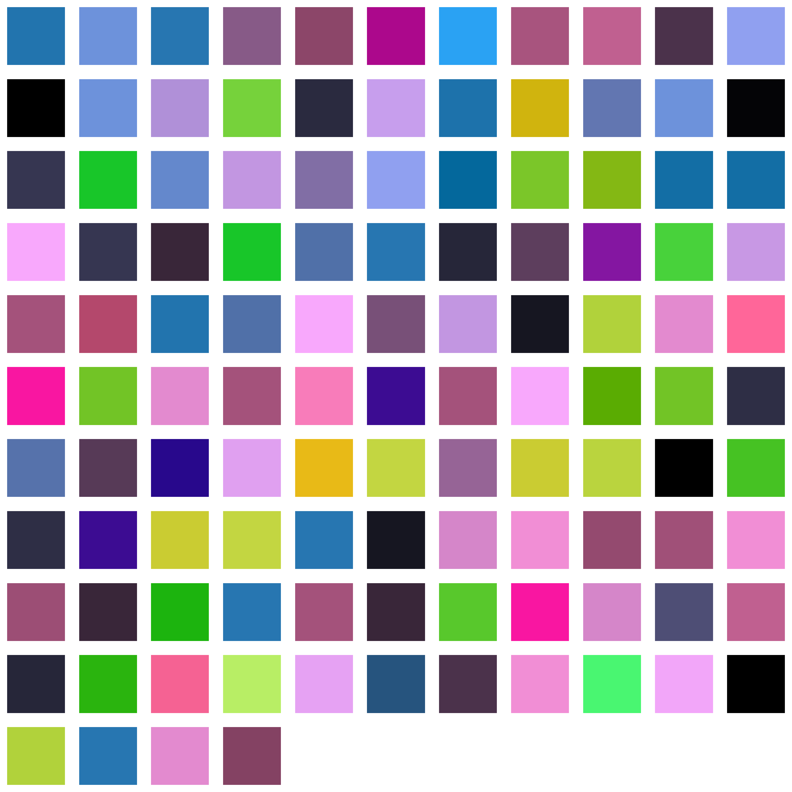

# Colorful Words (WIP)

[](https://github.com/AlexandreLadriere/ColorfulWords/blob/master/LICENSE)

This project aims to implement a tool to represents texts as colorful images.

## How to use
```
usage: Colorful Words [-h] [-tp TEXT_PATH] [-ts TEXT_STRING] -ip IMAGE_PATH
                      [-in IMAGE_NAME] [-if IMAGE_FORMAT] [-is IMAGE_SIZE]

Create an image reppresentation of a text. Each color represents a word

optional arguments:
  -h, --help            show this help message and exit
  -tp TEXT_PATH, --text_path TEXT_PATH
                        Path (str) of the txt file
  -ts TEXT_STRING, --text_string TEXT_STRING
                        Text (str) that you want to use
  -ip IMAGE_PATH, --image_path IMAGE_PATH
                        Path (str) of the folder where you want to save the image      
  -in IMAGE_NAME, --image_name IMAGE_NAME
                        Name (str) of the image you want to create
  -if IMAGE_FORMAT, --image_format IMAGE_FORMAT
                        Format (str) of the image you want to save
  -is IMAGE_SIZE, --image_size IMAGE_SIZE
                        Size (int) in pixels of the image you want to save
```
The following parameters are mandatory:
- ``IMAGE_PATH``

The following parameters are optionals:
- ``TEXT_PATH`` - default : `` ``
- ``TEXT_STRING`` - default : `` ``
- ``IMAGE_NAME`` - default : ``image``
- ``IMAGE_FORMAT`` - default : ``png``
- ``IMAGE_SIZE`` - default : ``2000``

Exemple of use :
```$ py ColorfulWords.py -tp "input\text.txt" -ip "output" -in "test" -if "png" -is 3000```
## Examples
<div align="center">
 
</div>

_Lorem ipsum dolor sit amet, consectetur adipiscing elit. Nunc sed justo a ipsum auctor rutrum in fringilla neque. Praesent congue ipsum ac ex ultrices malesuada. Mauris blandit, justo vitae elementum posuere, nulla nulla varius ex, nec ultrices ligula dolor at dui. Pellentesque pulvinar mattis orci. Donec lorem ligula, varius non mauris id, tincidunt laoreet lacus. Suspendisse convallis laoreet orci quis vestibulum. Orci varius natoque penatibus et magnis dis parturient montes, nascetur ridiculus mus. Quisque fermentum a turpis et vestibulum. Quisque ultricies, dolor id aliquam commodo, enim erat commodo arcu, nec luctus dolor orci nec tortor. Suspendisse iaculis ut quam at imperdiet. Fusce volutpat tempor lacinia. Nam commodo ullamcorper tellus, a tincidunt dolor egestas eget._

## License
This project is licensed under the MIT License - see the [LICENSE] file for details.

## Contributing
Contributions are welcome :smile:

### Pull requests
Just a few guidelines:
-   Write clean code with appropriate comments and add suitable error handling.
-   Test the application and make sure no bugs/ issues come up.
-   Open a pull request, and I will be happy to acknowledge your contribution after some checking from my side.

### Issues
If you find any bugs/issues, raise an issue.

  [LICENSE]: <LICENSE>
  